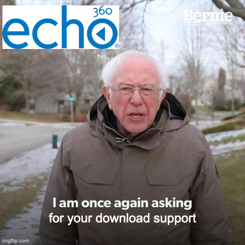

# Youtube-dl Firefox Addon (With Echo360 Support) 

 - Forked from [here](https://github.com/akhilkedia/youtube-dl-firefox-addon)
 - Firefox addon to download youtube videos using [youtube-dl](https://github.com/rg3/youtube-dl)

 

## Table of Contents

 * [What Youtube Dl Firefox Addon does](#what-youtube-dl-firefox-addon-does)
 * [Prerequisites](#prerequisites)
 * [How to install Youtube Dl Firefox Addon](#how-to-install-youtube-dl-firefox-addon)
 * [How to use this addon](#how-to-use-this-addon)

## What Youtube Dl Firefox Addon does

This is a firefox addon to which downloads youtube videos using [youtube-dl](https://github.com/rg3/youtube-dl).

Now with echo360 support.

You can configure youtube-dl to download only audio, or convert into any desired format after installing, or even download full youtube playlists. These options are controlled via youtube-dl's own [configuration](https://github.com/ytdl-org/youtube-dl#configuration)

## Prerequisites

1. Needs [youtube-dl](https://github.com/rg3/youtube-dl) installed.
2. Needs python installed.

## How to install Youtube Dl Firefox Addon

1. Clone this repo
2. Install the addon [firefox-command-runner.echo360.xpi](./firefox-command-runner-echo360.xpi) from this repo to firefox by double-clicking.
3. Edit the file [firefox_command_runner.json](./app/firefox_command_runner.json) and edit the `path` to the location of the file `./app/firefox-command-runner.py` (i.e., where you cloned this repo to.).
4. Copy the file `firefox_command_runner.json` to the correct manifest location. See documentation [here](https://developer.mozilla.org/en-US/docs/Mozilla/Add-ons/WebExtensions/Native_manifests#manifest_location)
5. Edit the config file for the correct ffmpeg PATH and other desired youtube-dl options, and the `firefox-command-runner.py` file for the correct youtube-dl PATH

## How to use this addon

1. Go to any youtube video page
1. Press the addon's logo in the toolbar once. (The logo looks like a YouTube icon).
1. The video will be downloaded automatically in the background.
1. After the download is finished, you will get a notification saying the download has finished. For the download locations, format, etc, please see youtube-dl's own [configuration](https://github.com/ytdl-org/youtube-dl#configuration)
